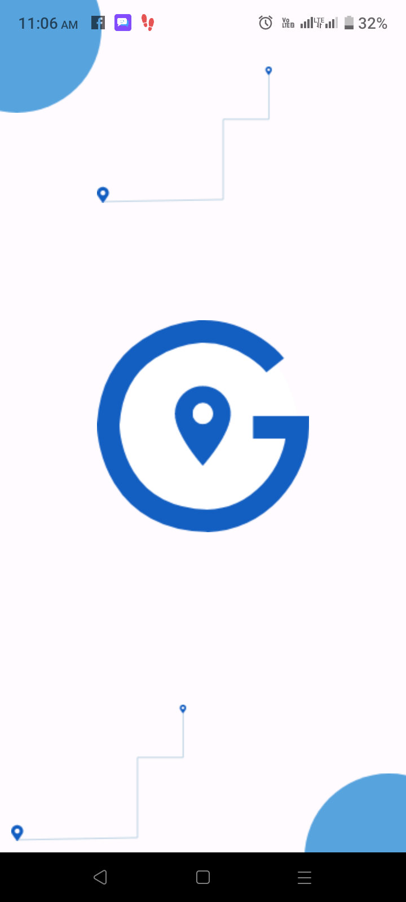
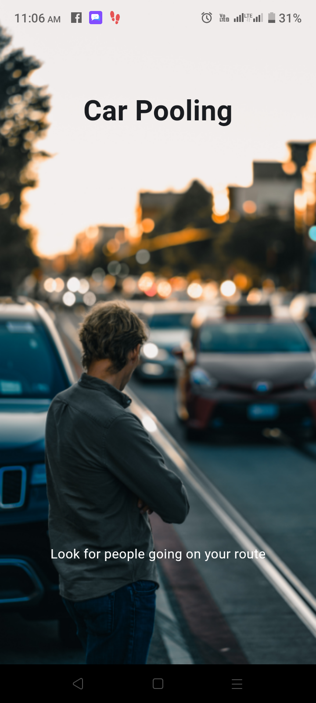
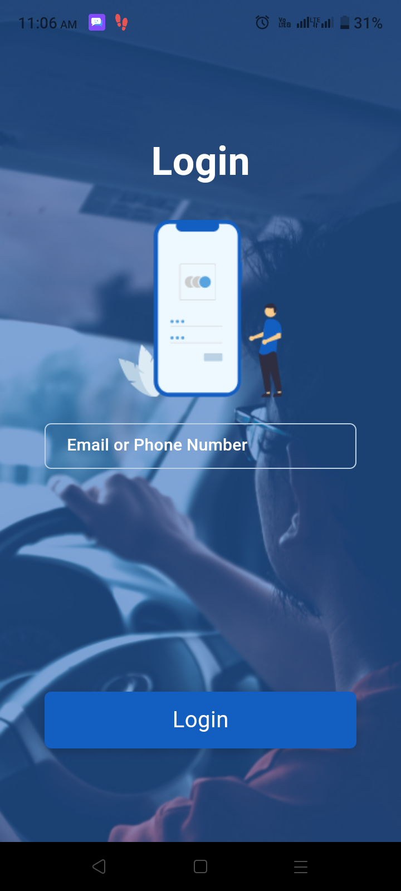
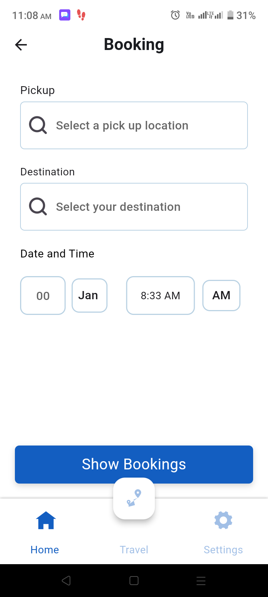
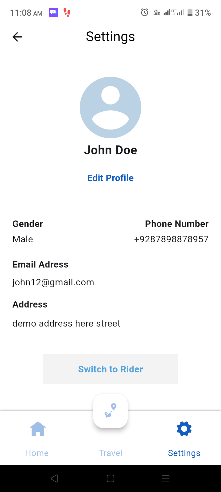
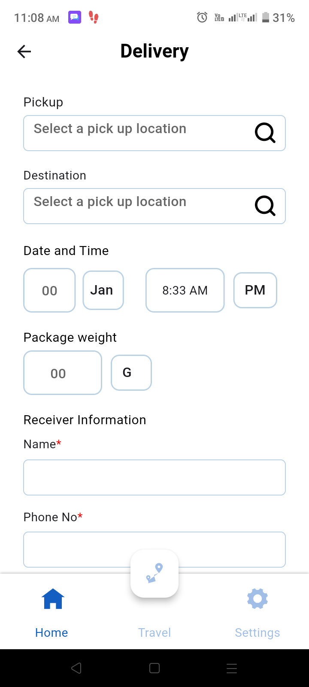
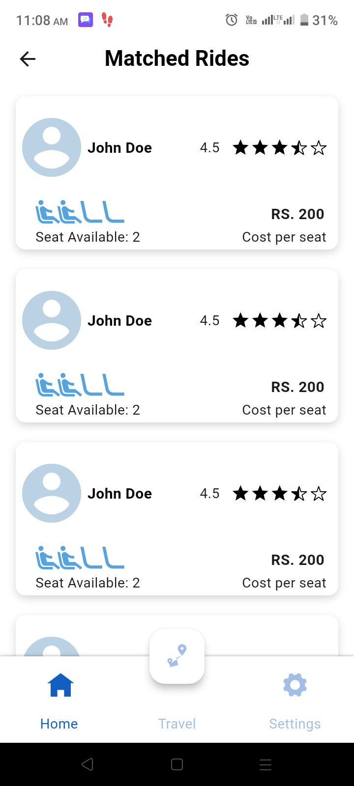
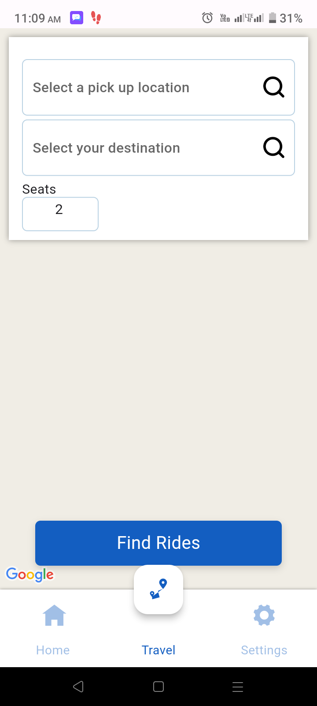
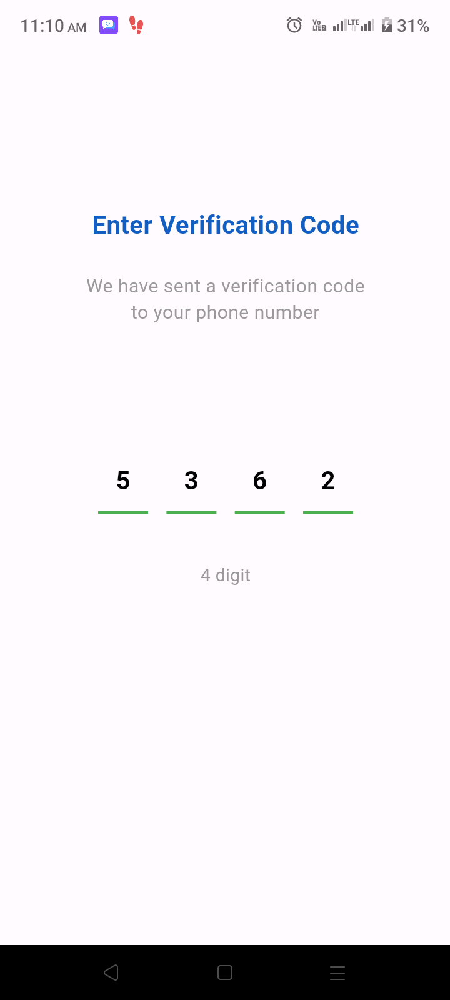
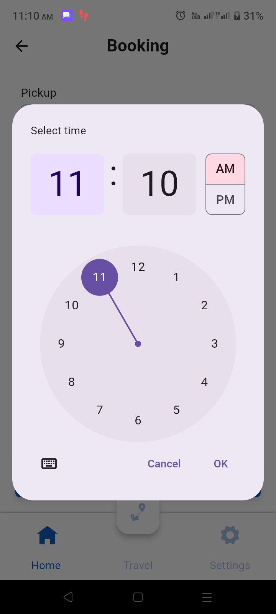

# Car-Pooling
INTRODUCTION

Car pooling has a unique business model. Rather than focusing on full-time drivers, anyone with a car can list their vehicle on the app and identify their route. If any passenger wants to join them, they can request a ride and share the expenses. It has a web portal and hybrid Flutter application.

KEY FEATURES:
1. Registration
2. Genetic algorithm to search a Driver in the vicinity (shortest distance)
3. Receiving Real-time Notifications
4. GPS and Location Determination
5. Booking Rides Ahead of Time
6.Payment
7. Cancellation Policies and Methods

TECHNOLOGIES & TOOLS USED

1. Google Map Api
2. Xcode
3. Flutter
4. Firebase

SCREENSHOTS

          
